# **Universitetsloven i Praksis: Forretningsregler modelleret med Beslutningsmodeller og Notation (DMN)**

## **Indledning**

Formålet med dette dokument er at præsentere en fuldstændig AI-genereret (ChatGPT o1-Preview) dokumentation af de danske universiteters forretningsregler udledt af [Bekendtgørelse af lov om universiteter (universitetsloven)](https://www.retsinformation.dk/eli/lta/2019/778) ved hjælp af [Decision Model and Notation (DMN)](https://www.omg.org/dmn/). Ved at modellere lovens bestemmelser i DMN skaber vi en struktureret og klar repræsentation af de forretningsregler, der styrer universitetets drift. Dette vil understøtte universiteternes arbejde med forretningsudvikling og systemunderstøttelse.

### **Formål med at bruge DMN**

- **Standardisering**: DMN er en international standard for modellering af beslutningslogik, hvilket sikrer en ensartet tilgang til dokumentation og implementering af forretningsregler.
- **Gennemsigtighed**: Gør beslutningsprocesser tydelige og forståelige for alle interessenter, herunder ledelse, administrative medarbejdere og IT-specialister.
- **Effektivitet**: Understøtter automatisering af beslutningsprocesser i vores IT-systemer, hvilket reducerer manuel arbejdskraft og minimerer fejl.
- **Vedligeholdelse**: Letter opdatering og vedligeholdelse af forretningsregler i takt med ændringer i lovgivningen eller interne politikker.

### **Metode**

For at dokumentere Universitetsloven i DMN har vi anvendt en iterativ og struktureret tilgang, som består af følgende trin:

1. **Analyse af Universitetsloven**: En systematisk gennemgang af hele lovteksten for at identificere relevante bestemmelser, forretningsregler og krav. Dette inkluderede en vurdering af sammenhængen mellem paragraffer og deres anvendelse i praksis.

2. **Udledning af beslutningskontekst**: For hver bestemmelse blev den forretningsmæssige kontekst analyseret for at fastslå formålet med beslutningen og dens betydning for universitetets aktiviteter.

3. **Identifikation af beslutningselementer**:
   - **Beslutninger**: Specificering af beslutninger, der skal træffes, og deres afhængigheder.
   - **Input**: Identifikation af nødvendige data og forudsætninger for hver beslutning, med en klar kobling til de relevante paragraffer.
   - **Output**: Definition af resultaterne af hver beslutning, såsom godkendelser, afvisninger eller særlige handlinger.

4. **Udarbejdelse af DMN-modeller**: 
   - Modellering af beslutningerne i overensstemmelse med DMN-standarden.
   - Udarbejdelse af beslutningstabeller, diagrammer og logik for at sikre entydige og konsistente beslutningsregler.
   - Visualisering af beslutningsprocesserne med PlantUML for at illustrere workflows og sporbarhed.

5. **Validering og justering**:
   - Gennemgang af modellerne for at sikre, at de er i fuld overensstemmelse med lovens intentioner og praksis.
   - Iterativ tilpasning baseret på feedback fra fagpersoner, der arbejder med lovens anvendelse i universitetssektoren.
   - Verificering af, at modellerne kan implementeres i praksis og understøtter automatisering af beslutningsprocesser.

6. **Integration i det praktiske applikationslandskab**: Modellerne blev vurderet i forhold til deres anvendelighed i eksisterende systemer og processer, med fokus på at understøtte universiteters behov for standardisering, effektivitet og compliance.

Denne metode har sikret, at DMN-modellerne både er juridisk korrekte og praktisk anvendelige, og at de kan understøtte universiteternes strategiske og operationelle mål.

## **Indholdsfortegnelse**

1. **Indledning og Metode**
    - **Klarhed og Struktur**: Indledningen giver en tydelig beskrivelse af dokumentets formål og anvendelsen af DMN til at modellere Universitetsloven.
    - **Metodeafsnit**: Beskriver detaljeret den iterative proces, der er anvendt til at udvikle DMN-modellerne, hvilket styrker dokumentets troværdighed.
2. **Indholdsfortegnelse**
    - **Overskuelighed**: En detaljeret indholdsfortegnelse hjælper læseren med at navigere i dokumentet og finde relevante afsnit hurtigt.
3. **Dokumentation af Universitetsloven i DMN**

    Alle relevante beslutninger er modelleret, og hver sektion indeholder:
    - **Lovhenvisning**: Klar angivelse af, hvilken paragraf i loven der adresseres.
    - **Beskrivelse**: En præcis beskrivelse af beslutningen og dens kontekst.
    - **DMN-komponenter**: Definerede beslutninger, input, output og hit policies.
    - **Beslutningstabel**: Tydelige tabeller med regler og betingelser.
    - **PlantUML-diagram**: Visuelle flowdiagrammer, der illustrerer beslutningsprocesserne.
    - **Sporbarhed til Loven**: Forklaringer, der knytter beslutningselementerne direkte til lovens bestemmelser.
    - **Bemærkninger**: Yderligere kontekst og overvejelser, der hjælper med at forstå beslutningerne.
    - **Konsistens og Nøjagtighed**: Beslutningsmodellerne er konsistente på tværs af dokumentet, og der er en klar sammenhæng mellem lovgrundlag og de modellerede regler.

4. **Implementering i Applikationslandskabet**
    - **Praktiske Anbefalinger**: Afsnittet giver konkrete trin til, hvordan DMN-modellerne kan integreres i universitetets IT-systemer og processer.
    - **Fokus på Governance**: Betoner vigtigheden af løbende opdatering og vedligeholdelse af modellerne i overensstemmelse med lovændringer.
5. **Konklusion**
    - **Opsummering af Fordele**: Understreger de forbedringer i overholdelse af lovgivningen, procesoptimering og strategisk understøttelse, som dokumentationen medfører.

## **Dokumentation af Universitetsloven i DMN**

Nedenfor præsenteres den fuldstændige dokumentation af Universitetsloven ved hjælp af DMN. Hver paragraf og stykke er analyseret og modelleret i overensstemmelse med DMN-standarderne.

### **Beslutning: Udbud af uddannelser**

#### **Lovhenvisning**: § 3, stk. 1-4

#### **Beskrivelse**: Universitetet træffer beslutning om udbud af forskningsbaserede uddannelser i Danmark og sikrer, at disse uddannelser er kvalitetssikrede og godkendt af ministeren før udbud.

#### **DMN-komponenter**:

- **Beslutning**: Udbud af uddannelser
- **Input**:
  - **Strategisk relevans** (`strategiskRelevans`): Indikerer, om uddannelsen er strategisk vigtig for universitetet (Boolean).
  - **Fagligt grundlag** (`fagligtGrundlag`): Vurdering af, om uddannelsen hviler på et solidt fagligt fundament inden for universitetets kompetenceområder (Boolean).
  - **Ressourcer til rådighed** (`ressourcerTilRådighed`): Om universitetet har de nødvendige ressourcer (personale, faciliteter osv.) til at gennemføre uddannelsen (Boolean).
  - **Kvalitetssikring opnået** (`kvalitetssikringOpnået`): Om uddannelsen har gennemgået og bestået nødvendig kvalitetssikring og akkreditering (Boolean).
  - **Ministeriel godkendelse** (`ministerielGodkendelse`): Om ministeren har godkendt uddannelsen i henhold til gældende lovgivning (Boolean).
- **Output**:
  - **Beslutning** (`beslutning`): Angiver, om udbuddet er godkendt eller afvist ("Udbud godkendt", "Udbud afvist").

#### **Hit Policy**: **U** (Unique) - Kun én regel kan gælde.

#### **Beslutningstabel**:

| **Regel** | `strategiskRelevans` | `fagligtGrundlag` | `ressourcerTilRådighed` | `kvalitetssikringOpnået` | `ministerielGodkendelse` | **Beslutning**      |
|-----------|----------------------|-------------------|-------------------------|--------------------------|--------------------------|---------------------|
| 1         | Ja                   | Ja                | Ja                      | Ja                       | Ja                       | Udbud godkendt      |
| 2         | Nej                  | -                 | -                       | -                        | -                        | Udbud afvist        |
| 3         | -                    | Nej               | -                       | -                        | -                        | Udbud afvist        |
| 4         | -                    | -                 | Nej                     | -                        | -                        | Udbud afvist        |
| 5         | -                    | -                 | -                       | Nej                      | -                        | Udbud afvist        |
| 6         | -                    | -                 | -                       | -                        | Nej                      | Udbud afvist        |

#### **Bemærkning**: "-" indikerer, at værdien er irrelevant for den pågældende regel.

#### **PlantUML-diagram**:

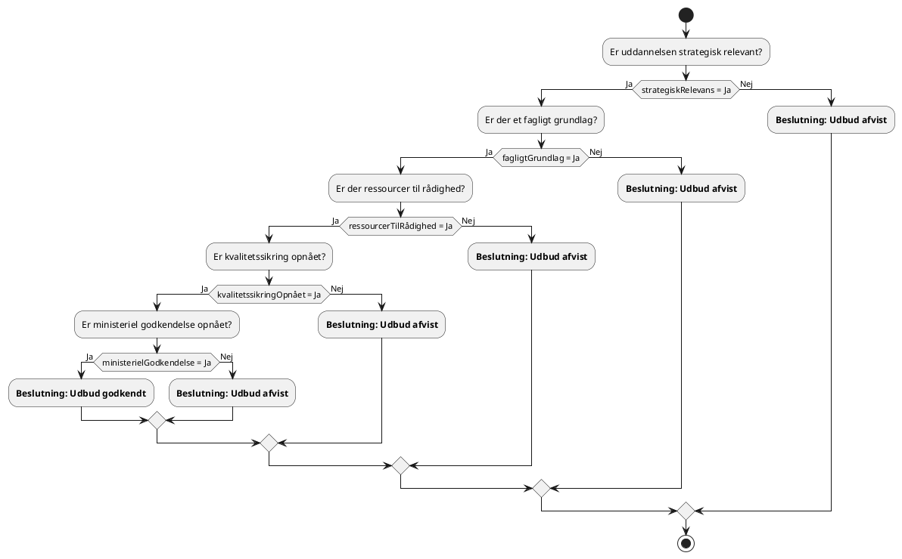

#### **Sporbarhed til Universitetsloven (§ 3, stk. 1-4)**:

1. **Strategisk relevans** (`strategiskRelevans`):

   - **Lovgrundlag**: § 3, stk. 1 - Universitetet beslutter selv, hvilke uddannelser det vil udbyde inden for sine fagområder. Dette kræver en strategisk vurdering af relevansen.

2. **Fagligt grundlag** (`fagligtGrundlag`):

   - **Lovgrundlag**: § 2, stk. 1 - Universitetet skal drive forskning og give forskningsbaseret uddannelse på højeste internationale niveau inden for sine fagområder. Uddannelsen skal have et solidt fagligt fundament.

3. **Ressourcer til rådighed** (`ressourcerTilRådighed`):

   - **Lovgrundlag**: Implicit i § 2 og § 3 - Universitetet skal sikre, at det har de nødvendige ressourcer til at udbyde uddannelserne effektivt.

4. **Kvalitetssikring opnået** (`kvalitetssikringOpnået`):

   - **Lovgrundlag**: § 3, stk. 1 - Uddannelserne skal kvalitetssikres og godkendes i henhold til lov om akkreditering af videregående uddannelsesinstitutioner.

5. **Ministeriel godkendelse** (`ministerielGodkendelse`):

   - **Lovgrundlag**: § 3, stk. 1 - Nye uddannelser skal godkendes af ministeren efter prækvalifikation og akkreditering.

#### **Bemærkninger**:

- **Krav til udbud**: For at en uddannelse kan udbydes, skal alle betingelser være opfyldt: strategisk relevans, fagligt grundlag, ressourcer, kvalitetssikring og ministeriel godkendelse.

- **Afvisning**: Hvis én eller flere af betingelserne ikke er opfyldt, kan uddannelsen ikke godkendes til udbud.

- **Lovmæssig overensstemmelse**: De anvendte begreber og beslutningskriterier er direkte afledt af Universitetsloven, hvilket sikrer fuld sporbarhed og lovmæssig overensstemmelse.

- **Strategisk beslutning**: Universitetets bestyrelse har ansvaret for den overordnede strategiske ledelse, herunder beslutning om udbud af nye uddannelser.

Beslutning: Optagelse af studerende på uddannelser

#### **Lovhenvisning**: § 8, stk. 1-3

#### **Beskrivelse**:

Universitetet skal beslutte, om en ansøger kan optages på en uddannelse, baseret på opfyldelse af adgangskrav, eventuelle karakterkrav og adgangsprøver samt tilgængelig kapacitet, i overensstemmelse med ministerens regler.

#### **DMN-komponenter**:

- **Beslutning**: Optagelse på uddannelse
- **Input**:
  - **Adgangskrav opfyldt** (`adgangskravOpfyldt`)
  - **Karakterkrav opfyldt** (`karakterkravOpfyldt`)
  - **Adgangsprøve bestået** (`adgangsprøveBestået`)
  - **Kapacitet til rådighed** (`kapacitetTilRådighed`)
- **Output**:
  - **Beslutning** (`beslutning`): "Optaget" eller "Afslag"

#### **Hit Policy**: U (Unique)

#### **Beslutningstabel**:

| **Regel** | `adgangskravOpfyldt` | `karakterkravOpfyldt`    | `adgangsprøveBestået`     | `kapacitetTilRådighed` | **Beslutning** |
|-----------|----------------------|--------------------------|---------------------------|------------------------|----------------|
| 1         | Ja                   | Ja eller Ikke relevant   | Ja eller Ikke relevant    | Ja                     | Optaget        |
| 2         | Nej                  | -                        | -                         | -                      | Afslag         |
| 3         | Ja                   | Nej                      | -                         | -                      | Afslag         |
| 4         | Ja                   | Ja eller Ikke relevant   | Nej                       | -                      | Afslag         |
| 5         | Ja                   | Ja eller Ikke relevant   | Ja eller Ikke relevant    | Nej                    | Afslag         |

**Bemærkning**: "-" indikerer, at værdien er irrelevant for den pågældende regel.

#### **PlantUML-diagram**:

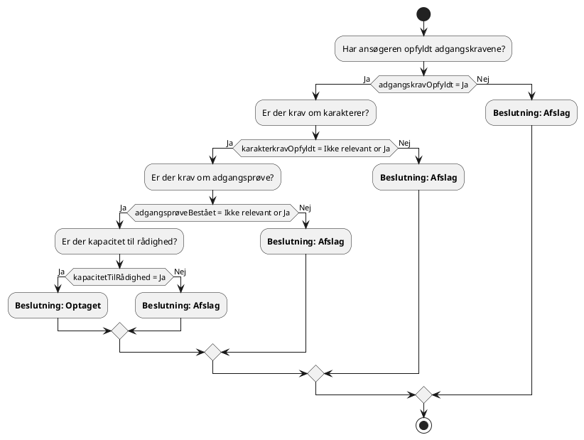

#### **Sporbarhed til Universitetsloven (§ 8, stk. 1-3)**:

1. **Adgangskrav opfyldt**:

   - § 8, stk. 1: Universitetet fastsætter adgangskrav i overensstemmelse med ministeriets regler.

2. **Karakterkrav opfyldt**:

   - § 8, stk. 1: Ministeren kan fastsætte regler om karakterkrav.

3. **Adgangsprøve bestået**:

   - § 8, stk. 1: Ministeren kan fastsætte regler om adgangsprøver.

4. **Kapacitet til rådighed**:

   - § 8, stk. 1 og § 4, stk. 5: Universitetet skal sikre, at der er kapacitet til at optage ansøgerne.

#### **Bemærkninger**:

- **Omfattende**: Den samlede sektion dækker alle relevante aspekter af optagelsesprocessen.
- **Fleksibilitet**: Ved at inkludere "Ikke relevant" som en mulighed for `karakterkravOpfyldt` og `adgangsprøveBestået`, tager vi højde for, at ikke alle uddannelser har disse krav.
- **Konsistens**: Sammenlægningen sikrer, at der ikke er modstridende oplysninger i dokumentet.

### **Beslutning: Kvalitetssikring af uddannelser**

#### **Lovhenvisning**: § 3, stk. 1

#### **Beskrivelse**: Uddannelserne skal kvalitetssikres og akkrediteres i henhold til gældende lovgivning, før de kan udbydes. Dette sikrer, at uddannelserne lever op til fastsatte kvalitetsstandarder og opfylder kravene i lov om akkreditering af videregående uddannelsesinstitutioner.

#### **DMN-komponenter**:

- **Beslutning**: Kvalitetssikringsgodkendelse
- **Input**:
  - **Kvalitetsstandarder opfyldt** (`kvalitetsstandarderOpfyldt`): Indikerer, om uddannelsen opfylder de nødvendige kvalitetsstandarder (Boolean).
  - **Akkrediteringsrapport positiv** (`akkrediteringsrapportPositiv`): Angiver, om akkrediteringsrapporten er positiv (Boolean).
- **Output**:
  - **Beslutning** (`beslutning`): Resultatet af kvalitetssikringsprocessen ("Godkendt", "Ikke godkendt").

#### **Hit Policy**: **U** (Unique) - Kun én regel kan gælde.

#### **Beslutningstabel**:

| **Regel** | `kvalitetsstandarderOpfyldt` | `akkrediteringsrapportPositiv` | **Beslutning**   |
|-----------|------------------------------|-------------------------------|------------------|
| 1         | Ja                           | Ja                            | Godkendt         |
| 2         | Nej                          | -                             | Ikke godkendt    |
| 3         | -                            | Nej                           | Ikke godkendt    |

#### **Bemærkning**: "-" indikerer, at værdien er irrelevant for den pågældende regel.

#### **PlantUML-diagram**:

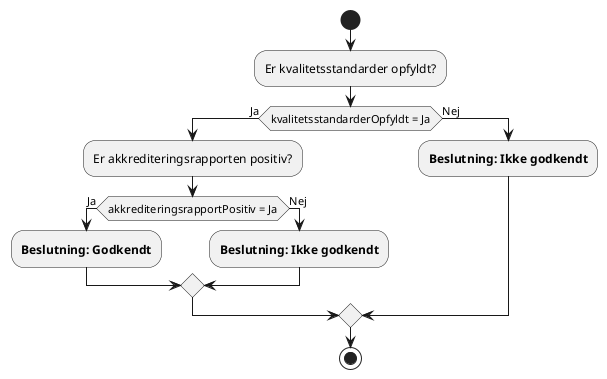

#### **Sporbarhed til Universitetsloven (§ 3, stk. 1)**:

1. **Kvalitetsstandarder opfyldt** (`kvalitetsstandarderOpfyldt`):

   - **Lovgrundlag**: § 3, stk. 1 - Universitetets udbud af uddannelser skal kvalitetssikres. Dette indebærer, at uddannelserne skal leve op til de fastsatte kvalitetsstandarder for videregående uddannelser.

2. **Akkrediteringsrapport positiv** (`akkrediteringsrapportPositiv`):

   - **Lovgrundlag**: § 3, stk. 1 - Nye uddannelser skal prækvalificeres og godkendes i henhold til lov om akkreditering af videregående uddannelsesinstitutioner. En positiv akkrediteringsrapport er en forudsætning for ministeriel godkendelse og dermed for at kunne udbyde uddannelsen.

#### **Bemærkninger**:

- **Krav til godkendelse**: For at en uddannelse kan godkendes og udbydes, skal både kvalitetsstandarderne være opfyldt, og akkrediteringsrapporten skal være positiv.
- **Afvisning**: Hvis enten kvalitetsstandarderne ikke er opfyldt, eller akkrediteringsrapporten er negativ, vil uddannelsen ikke blive godkendt til udbud.
- **Lovmæssig overensstemmelse**: De anvendte begreber og beslutningskriterier er direkte afledt af kravene i Universitetsloven og sikrer fuld sporbarhed til lovens bestemmelser.

### **Beslutning: Udbud af uddannelser i udlandet**

#### **Lovhenvisning**: § 3 a, stk. 1-6

#### **Beskrivelse**: Universitetet kan udbyde hele eller dele af uddannelser i udlandet i samarbejde med udenlandske universiteter under visse betingelser. Dette kræver en gyldig samarbejdsaftale, kvalitetssikring og opfyldelse af juridiske krav.

#### **DMN-komponenter**:

- **Beslutning**: Udbud af international uddannelse
- **Input**:
  - **Samarbejdsaftale eksisterer** (`samarbejdsaftaleEksisterer`): Indikerer, om der er en gyldig samarbejdsaftale med det udenlandske universitet (Boolean).
  - **Kvalitetssikring opnået** (`kvalitetssikringOpnået`): Om uddannelsen har gennemgået nødvendig kvalitetssikring (Boolean).
  - **Juridiske krav opfyldt** (`juridiskeKravOpfyldt`): Om alle relevante juridiske krav er opfyldt (Boolean).
- **Output**:
  - **Beslutning** (`beslutning`): Resultatet af beslutningen ("Godkendt", "Afvist").

#### **Hit Policy**: **U** (Unique) - Kun én regel kan gælde.

#### **Beslutningstabel**:

| **Regel** | `samarbejdsaftaleEksisterer` | `kvalitetssikringOpnået` | `juridiskeKravOpfyldt` | **Beslutning** |
|-----------|------------------------------|--------------------------|------------------------|----------------|
| 1         | Ja                           | Ja                       | Ja                     | Godkendt       |
| 2         | Nej                          | -                        | -                      | Afvist         |
| 3         | Ja                           | Nej                      | -                      | Afvist         |
| 4         | Ja                           | Ja                       | Nej                    | Afvist         |

#### **Bemærkning**: "-" indikerer, at værdien er irrelevant for den pågældende regel.

#### **PlantUML-diagram**:

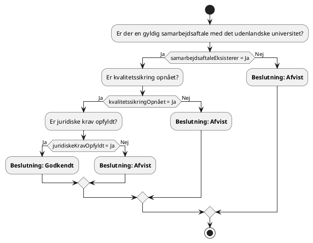

#### **Sporbarhed til Universitetsloven (§ 3 a, stk. 1-6)**:

1. **Samarbejdsaftale eksisterer** (`samarbejdsaftaleEksisterer`):

   - **Lovgrundlag**: § 3 a, stk. 1 - Universitetet kan udbyde hele uddannelser i udlandet i samarbejde med et eller flere udenlandske universiteter. Dette kræver en formel samarbejdsaftale.

2. **Kvalitetssikring opnået** (`kvalitetssikringOpnået`):

   - **Lovgrundlag**: § 3 a, stk. 1 - Uddannelserne skal kvalitetssikres og godkendes efter gældende regler, som sikrer, at kvaliteten svarer til danske standarder.

3. **Juridiske krav opfyldt** (`juridiskeKravOpfyldt`):

   - **Lovgrundlag**: § 3 a, stk. 2-6 - Universitetet skal overholde både danske og relevante udenlandske love og regler, herunder krav om godkendelser fra udenlandske myndigheder.

#### **Bemærkninger**:

- **Vigtigheden af samarbejdsaftaler**: En gyldig samarbejdsaftale er afgørende for at sikre klare rammer og ansvar mellem de involverede universiteter.

- **Kvalitetssikring**: Det er essentielt, at uddannelsen opfylder kvalitetskravene for at sikre anerkendelse og legitimitet både i Danmark og internationalt.

- **Juridiske krav**: Overholdelse af juridiske krav er nødvendig for at undgå lovmæssige problemer og sikre, at uddannelsen kan gennemføres uden hindringer.

- **Afvisning**: Manglende opfyldelse af nogen af disse betingelser fører til afvisning af udbuddet af uddannelsen i udlandet.

### **Beslutning: Tilmelding til fag og prøver**

#### **Lovhenvisning**: § 8, stk. 1-3

#### **Beskrivelse**: Studerende skal tilmeldes fag og prøver i overensstemmelse med uddannelsens studieordning og ministeriets regler. Universitetet skal sikre, at tilmeldingen opfylder alle krav, herunder studieaktivitetskrav, beståede forudsætningsfag og ECTS-begrænsninger.

#### **DMN-komponenter**:

- **Beslutning**: Tilmelding til fag og prøver
- **Input**:
  - **Studieaktivitetskrav opfyldt** (`studieaktivitetskravOpfyldt`): Om den studerende opfylder kravene til studieaktivitet (Boolean).
  - **Tidligere fag bestået** (`tidligereFagBestået`): Om den studerende har bestået nødvendige forudsætningsfag (Boolean).
  - **ECTS-begrænsninger overholdt** (`ectsBegrænsningerOverholdt`): Om den studerende overholder maksimalt tilladte ECTS-point (Boolean).
- **Output**:
  - **Beslutning** (`beslutning`): Resultatet af tilmeldingsprocessen ("Godkendt", "Afvist").

#### **Hit Policy**: **U** (Unique) - Kun én regel kan gælde.

#### **Beslutningstabel**:

| **Regel** | `studieaktivitetskravOpfyldt` | `tidligereFagBestået` | `ectsBegrænsningerOverholdt` | **Beslutning** |
|-----------|-------------------------------|-----------------------|------------------------------|----------------|
| 1         | Ja                            | Ja                    | Ja                           | Godkendt       |
| 2         | Nej                           | -                     | -                            | Afvist         |
| 3         | -                             | Nej                   | -                            | Afvist         |
| 4         | -                             | -                     | Nej                          | Afvist         |

#### **Bemærkning**: "-" indikerer, at værdien er irrelevant for den pågældende regel.

#### **PlantUML-diagram**:

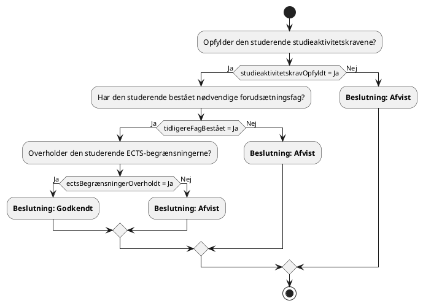

#### **Sporbarhed til Universitetsloven (§ 8, stk. 1-3)**:

1. **Studieaktivitetskrav opfyldt** (`studieaktivitetskravOpfyldt`):

   - **Lovgrundlag**: § 8, stk. 1 - Studerende skal opfylde universitetets krav til studieaktivitet for at kunne fortsætte på uddannelsen og tilmeldes fag og prøver.

2. **Tidligere fag bestået** (`tidligereFagBestået`):

   - **Lovgrundlag**: Universitetet kan fastsætte regler om, at visse fag skal være bestået før tilmelding til efterfølgende fag.

3. **ECTS-begrænsninger overholdt** (`ectsBegrænsningerOverholdt`):

   - **Lovgrundlag**: Ministeren kan fastsætte regler om maksimum for antal ECTS-point pr. semester, som den studerende må tilmeldes.

#### **Bemærkninger**:

- **Tilmeldingskrav**: Alle tre krav skal være opfyldt for at tilmeldingen kan godkendes.

- **Afvisning**: Manglende opfyldelse af ét eller flere krav medfører afvisning af tilmeldingen.

- **Studieordningen**: Tilmeldingen skal være i overensstemmelse med studieordningen og universitetets regler.

- **Fleksibilitet**: Universitetet kan i særlige tilfælde dispensere fra kravene, hvis det er begrundet.

### **Beslutning: Opkrævning af deltagerbetaling**

#### **Lovhenvisning**: § 26, stk. 1-9

#### **Beskrivelse**: Universitetet skal opkræve deltagerbetaling for visse uddannelsesaktiviteter i overensstemmelse med loven. Dette omfatter bl.a. deltidsuddannelser, heltidsuddannelser uden tilskud, ekstra uddannelsesaktiviteter og uddannelser for udenlandske studerende uden krav på ligebehandling.

#### **DMN-komponenter**:

- **Beslutning**: Beregning af deltagerbetaling
- **Input**:
  - **Uddannelsestype** (`uddannelsestype`): Typen af uddannelsesaktivitet ("Heltid", "Deltid", "Ekstra aktivitet", "Selvstuderende").
  - **Tilskud modtaget** (`tilskudModtaget`): Om universitetet modtager tilskud til aktiviteten (Boolean).
  - **Statsborgerskab** (`statsborgerskab`): Studerendes statsborgerskab ("Dansk/EU", "Ikke-EU").
- **Output**:
  - **Deltagerbetaling** (`deltagerbetaling`): Betalingstype ("Ingen betaling", "Delvis betaling", "Fuld betaling").

#### **Hit Policy**: **U** (Unique) - Kun én regel kan gælde.

#### **Beslutningstabel**:

| **Regel** | `uddannelsestype`    | `tilskudModtaget` | `statsborgerskab` | **Deltagerbetaling** |
|-----------|----------------------|-------------------|-------------------|----------------------|
| 1         | Deltid               | Ja                | Dansk/EU          | Delvis betaling      |
| 2         | Heltid               | Nej               | Ikke-EU           | Fuld betaling        |
| 3         | Ekstra aktivitet     | Nej               | Dansk/EU          | Ingen betaling       |
| 4         | Heltid               | Ja                | Dansk/EU          | Ingen betaling       |
| 5         | Selvstuderende       | -                 | -                 | Fuld betaling        |
| 6         | Alle                 | -                 | Ikke-EU           | Fuld betaling        |

#### **Bemærkning**: "-" indikerer, at værdien er irrelevant for den pågældende regel.

#### **PlantUML-diagram**:

```plantuml
@startuml
' Afsnit: §26, stk. 1-9 - Beslutning: Opkrævning af deltagerbetaling

start
:Identificer uddannelsestype;
switch (uddannelsestype)
  case "Deltid":
    :Modtager universitetet tilskud?;
    if (tilskudModtaget = Ja) then (Ja)
      :**Deltagerbetaling: Delvis betaling**;
    else (Nej)
      :**Deltagerbetaling: Fuld betaling**;
    endif
  case "Heltid":
    :Er den studerende fra Danmark/EU?;
    if (statsborgerskab = "Dansk/EU") then (Ja)
      :Modtager universitetet tilskud?;
      if (tilskudModtaget = Ja) then (Ja)
        :**Deltagerbetaling: Ingen betaling**;
      else (Nej)
        :**Deltagerbetaling: Fuld betaling**;
      endif
    else (Nej)
      :**Deltagerbetaling: Fuld betaling**;
    endif
  case "Ekstra aktivitet":
    :Er den studerende fra Danmark/EU?;
    if (statsborgerskab = "Dansk/EU") then (Ja)
      :**Deltagerbetaling: Ingen betaling**;
    else (Nej)
      :**Deltagerbetaling: Fuld betaling**;
    endif
  case "Selvstuderende":
    :**Deltagerbetaling: Fuld betaling**;
endswitch
stop
@enduml
```

#### **Sporbarhed til Universitetsloven (§ 26, stk. 1-9)**:

1. **Deltidsuddannelse med delvis betaling**:

   - **Lovgrundlag**: § 26, stk. 1 - Universitetet opkræver delvis betaling for deltagelse i undervisning og prøver under deltidsuddannelse, hvortil der ydes delvis tilskud.

2. **Heltidsuddannelse uden tilskud for ikke-EU-studerende**:

   - **Lovgrundlag**: § 26, stk. 2 - Universitetet skal opkræve fuld betaling under heltidsuddannelse, hvis der ikke er ydet tilskud, og den studerende ikke har krav på ligebehandling.

3. **Ekstra uddannelsesaktivitet for danske/EU-studerende**:

   - **Lovgrundlag**: § 26, stk. 3 - Universitetet afholder udgiften til ekstra uddannelsesaktivitet for danske borgere og borgere med krav på ligebehandling.

4. **Heltidsuddannelse med tilskud for danske/EU-studerende**:

   - **Lovgrundlag**: § 26, stk. 4 - Studerende, der modtager tilskud, betaler ikke deltagerbetaling.

5. **Selvstuderende**:

   - **Lovgrundlag**: § 26, stk. 5 - Universitetet skal opkræve fuld betaling fra selvstuderende for deltagelse i prøver.

6. **Studerende fra ikke-EU-lande**:

   - **Lovgrundlag**: § 26, stk. 2 og stk. 3 - Universitetet skal opkræve fuld betaling fra udenlandske borgere, der ikke har krav på ligebehandling med danske borgere.

#### **Bemærkninger**:

- **Fuld betaling**: Gælder primært for studerende uden for EU/EØS og Schweiz, samt for aktiviteter uden tilskud.

- **Delvis betaling**: Anvendes ved deltidsuddannelser, hvor der ydes delvis tilskud.

- **Ingen betaling**: Gælder for danske og EU-studerende på heltidsuddannelser med tilskud og for ekstra aktiviteter for disse studerende.

- **Tilskud**: Universitetets modtagelse af statstilskud er afgørende for, om der skal opkræves deltagerbetaling.

- **Lovmæssig overensstemmelse**: Beslutningsprocessen sikrer, at opkrævning af deltagerbetaling sker i overensstemmelse med lovens bestemmelser.

### **Beslutning: Tildeling af fripladser og stipendier**

#### **Lovhenvisning**: § 19, stk. 9-10

#### **Beskrivelse**: Universitetet kan tildele fripladser og stipendier til visse udenlandske studerende inden for rammerne af finansloven og egne midler. Dette skal ske i overensstemmelse med ministerens regler og universitetets interne retningslinjer.

#### **DMN-komponenter**:

- **Beslutning**: Tildeling af friplads/stipendium
- **Input**:
  - **Nationalitet** (`nationalitet`): Studerendes nationalitet ("Udenlandsk (uden for EU/EØS)", "Dansk/EU/EØS").
  - **Akademiske kvalifikationer opfyldt** (`akademiskeKvalifikationerOpfyldt`): Om den studerende opfylder de faglige krav (Boolean).
  - **Økonomiske behov dokumenteret** (`økonomiskeBehovDokumenteret`): Om den studerende har dokumenteret økonomisk behov (Boolean).
  - **Ramme til rådighed** (`rammeTilRådighed`): Om der er ledige fripladser/stipendier inden for den fastsatte ramme (Boolean).
- **Output**:
  - **Beslutning** (`beslutning`): Resultatet af vurderingen ("Tildeling", "Afslag", "Ikke relevant").

#### **Hit Policy**: **U** (Unique) - Kun én regel kan gælde.

#### **Beslutningstabel**:

| **Regel** | `nationalitet`                         | `akademiskeKvalifikationerOpfyldt` | `økonomiskeBehovDokumenteret` | `rammeTilRådighed` | **Beslutning**  |
|-----------|----------------------------------------|------------------------------------|-------------------------------|--------------------|-----------------|
| 1         | Udenlandsk (uden for EU/EØS/Schweiz)   | Ja                                 | Ja                            | Ja                 | Tildeling       |
| 2         | Udenlandsk (uden for EU/EØS/Schweiz)   | Nej                                | -                             | -                  | Afslag          |
| 3         | Udenlandsk (uden for EU/EØS/Schweiz)   | Ja                                 | Nej                           | -                  | Afslag          |
| 4         | Udenlandsk (uden for EU/EØS/Schweiz)   | Ja                                 | Ja                            | Nej                | Afslag          |
| 5         | Dansk eller Udenlandsk (EU/EØS/Schweiz)| -                                  | -                             | -                  | Ikke berettiget |

**Opdateret PlantUML-diagram**:

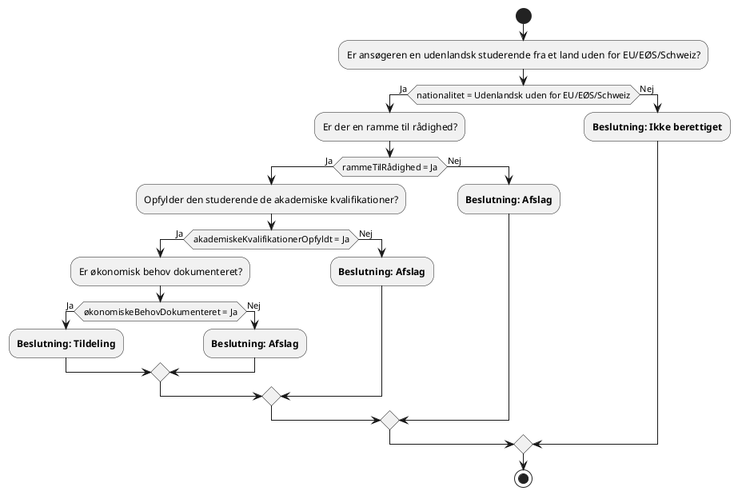

**Sporbarhed**:

- **Nationalitet**: Kun udenlandske studerende fra lande uden for EU/EØS/Schweiz er berettigede, jf. ministerielle regler udstedt i henhold til § 19, stk. 10.
- **Akademiske kvalifikationer** og **økonomiske behov**: Krav om opfyldelse af faglige kvalifikationer og dokumentation af økonomisk behov.
- **Ramme til rådighed**: Begrænset antal fripladser og stipendier fastsat på finansloven.

#### **Sporbarhed til Universitetsloven (§ 19, stk. 9-10)**:

1. **Nationalitet** (`nationalitet`):

   - **Lovgrundlag**: § 19, stk. 9 - Universitetet kan tildele fripladser til visse udenlandske studerende. Dette omfatter typisk studerende fra lande uden for EU/EØS.

2. **Akademiske kvalifikationer opfyldt** (`akademiskeKvalifikationerOpfyldt`):

   - **Lovgrundlag**: Ministeren fastsætter regler om, hvilke udenlandske studerende der kan opnå fripladser, herunder krav til faglige kvalifikationer.

3. **Økonomiske behov dokumenteret** (`økonomiskeBehovDokumenteret`):

   - **Lovgrundlag**: § 19, stk. 9 og 10 - Stipendiet er støtte til at dække leveomkostninger, og tildeling kan baseres på økonomisk behov.

4. **Ramme til rådighed** (`rammeTilRådighed`):

   - **Lovgrundlag**: § 19, stk. 9 - Rammen for fripladser og stipendier fastsættes på de årlige finanslove.

#### **Bemærkninger**:

- **Ikke relevant for danske/EU/EØS-studerende**: Disse studerende har normalt adgang til uddannelser uden betaling og er ikke omfattet af ordningen.

- **Vigtigheden af ramme**: Tildeling afhænger af, om der er midler og pladser til rådighed inden for den fastsatte ramme.

- **Afslag**: Manglende opfyldelse af faglige krav eller dokumentation af økonomisk behov fører til afslag.

- **Lovmæssig overensstemmelse**: Beslutningsprocessen sikrer, at tildeling af fripladser og stipendier sker i overensstemmelse med lovens bestemmelser og ministerens regler.

### **Beslutning: Klagebehandling**

#### **Lovhenvisning**: § 34

#### **Beskrivelse**: Behandling af retlige spørgsmål ved universitetets afgørelser om studerendes forhold. Klager over retlige spørgsmål kan indbringes for ministeren efter regler fastsat af denne.

#### **DMN-komponenter**:

- **Beslutning**: Klageafgørelse
- **Input**:
  - **Klage rettidig** (`klageRettidig`): Om klagen er indgivet inden for klagefristen (Boolean).
  - **Retligt spørgsmål** (`retligtSpørgsmål`): Om klagen vedrører et retligt spørgsmål (Boolean).
  - **Tidligere behandlet** (`tidligereBehandlet`): Om klagen allerede er behandlet tidligere (Boolean).
- **Output**:
  - **Beslutning** (`beslutning`): Resultatet af klagebehandlingen ("Klage behandles", "Klage afvises", "Klage afvist - allerede behandlet").

#### **Hit Policy**: **U** (Unique) - Kun én regel kan gælde.

#### **Beslutningstabel**:

| **Regel** | `klageRettidig` | `retligtSpørgsmål` | `tidligereBehandlet` | **Beslutning**                          |
|-----------|-----------------|--------------------|----------------------|-----------------------------------------|
| 1         | Ja              | Ja                 | Nej                  | Klage behandles                         |
| 2         | Nej             | -                  | -                    | Klage afvises                           |
| 3         | Ja              | Nej                | -                    | Klage afvises                           |
| 4         | Ja              | Ja                 | Ja                   | Klage afvist - allerede behandlet       |

#### **Bemærkning**: "-" indikerer, at værdien er irrelevant for den pågældende regel.

#### **PlantUML-diagram**:

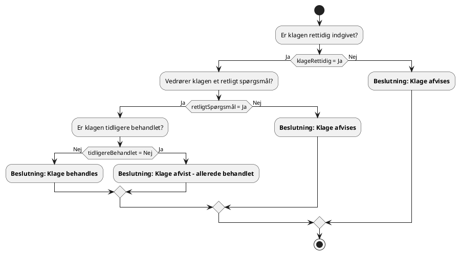

#### **Sporbarhed til Universitetsloven (§ 34)**:

1. **Klage rettidig** (`klageRettidig`):

   - **Lovgrundlag**: § 34, stk. 1 - Klager skal indgives inden for en fastsat frist for at kunne behandles.

2. **Retligt spørgsmål** (`retligtSpørgsmål`):

   - **Lovgrundlag**: § 34, stk. 1 - Kun retlige spørgsmål kan indbringes for ministeren.

3. **Tidligere behandlet** (`tidligereBehandlet`):

   - **Lovgrundlag**: God forvaltningsskik tilsiger, at samme klage ikke behandles flere gange, medmindre der er nye oplysninger.

#### **Bemærkninger**:

- **Retlige spørgsmål**: Vedrører spørgsmål om, hvorvidt lovgivningen er korrekt anvendt, og om afgørelsen er lovlig.

- **Afvisning af klage**: Hvis klagen ikke er rettidig eller ikke vedrører et retligt spørgsmål, skal den afvises.

- **Allerede behandlet**: Hvis klagen allerede er behandlet, og der ikke foreligger nye væsentlige oplysninger, kan klagen afvises.

- **Lovmæssig overensstemmelse**: Beslutningsprocessen sikrer korrekt håndtering af klager i overensstemmelse med loven.

### **Beslutning: Ansættelse og afskedigelse af personale**

#### **Lovhenvisning**: § 29

#### **Beskrivelse**: Universitetet skal følge de fastsatte regler om løn- og ansættelsesvilkår for personale. Dette omfatter overholdelse af krav til ansættelse, kvalifikationer og gældende overenskomster.

#### **DMN-komponenter**:

- **Beslutning**: Ansættelsesbeslutning
- **Input**:
  - **Krav opfyldt** (`kravOpfyldt`): Om ansøgeren opfylder de formelle krav til stillingen (Boolean).
  - **Kvalifikationer passende** (`kvalifikationerPassende`): Om ansøgerens kvalifikationer matcher stillingens behov (Boolean).
  - **Overenskomst overholdt** (`overenskomstOverholdt`): Om ansættelsen er i overensstemmelse med gældende overenskomster og aftaler (Boolean).
- **Output**:
  - **Beslutning** (`beslutning`): Resultatet af ansættelsesprocessen ("Ansættelse", "Afslag").

#### **Hit Policy**: **U** (Unique) - Kun én regel kan gælde.

#### **Beslutningstabel**:

| **Regel** | `kravOpfyldt` | `kvalifikationerPassende` | `overenskomstOverholdt` | **Beslutning** |
|-----------|---------------|---------------------------|--------------------------|----------------|
| 1         | Ja            | Ja                        | Ja                       | Ansættelse     |
| 2         | Nej           | -                         | -                        | Afslag         |
| 3         | Ja            | Nej                       | -                        | Afslag         |
| 4         | Ja            | Ja                        | Nej                      | Afslag         |

#### **Bemærkning**: "-" indikerer, at værdien er irrelevant for den pågældende regel.

#### **PlantUML-diagram**:

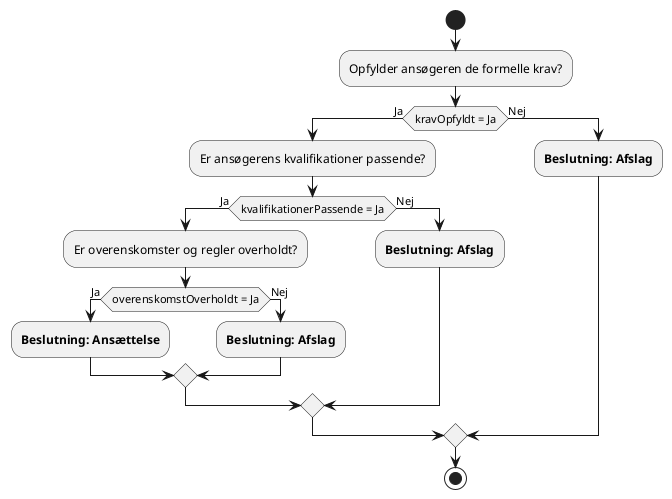

#### **Sporbarhed til Universitetsloven (§ 29)**:

1. **Krav opfyldt** (`kravOpfyldt`):

   - **Lovgrundlag**: Universitetet skal sikre, at ansatte opfylder de formelle krav til stillingen.

2. **Kvalifikationer passende** (`kvalifikationerPassende`):

   - **Lovgrundlag**: Det er universitetets ansvar at vurdere, om ansøgerens kvalifikationer matcher stillingens behov.

3. **Overenskomst overholdt** (`overenskomstOverholdt`):

   - **Lovgrundlag**: § 29, stk. 1 - Universitetet skal følge de af finansministeren fastsatte eller aftalte regler om løn- og ansættelsesvilkår, herunder overenskomster.

#### **Bemærkninger**:

- **Ansættelse**: Kan kun ske, hvis alle tre betingelser er opfyldt.

- **Afslag**: Gives, hvis ansøgeren ikke opfylder formelle krav, ikke har passende kvalifikationer, eller hvis ansættelsen ikke kan ske i overensstemmelse med overenskomster.

- **Overholdelse af regler**: Vigtigt for at sikre korrekt ansættelsespraksis og undgå konflikter med faglige organisationer.

- **Lovmæssig overensstemmelse**: Beslutningsprocessen sikrer, at ansættelser sker i overensstemmelse med lovens bestemmelser og gældende overenskomster.

### **Beslutning: Økonomiske dispositioner**

#### **Lovhenvisning**: § 21

#### **Beskrivelse**: Universitetet disponerer frit inden for sit formål ved anvendelse af tilskud, indtægter og kapital under ét, dog under overholdelse af tilskudsbetingelser og disponeringsregler. Økonomiske dispositioner skal være i overensstemmelse med loven og universitetets formål.

#### **DMN-komponenter**:

- **Beslutning**: Økonomisk disposition
- **Input**:
  - **Formål overholdt** (`formålOverholdt`): Om dispositionen er i overensstemmelse med universitetets formål (Boolean).
  - **Tilskudsbetingelser overholdt** (`tilskudsbetingelserOverholdt`): Om eventuelle betingelser for tilskud er overholdt (Boolean).
  - **Budgetdækning** (`budgetDækning`): Om der er budgetmæssig dækning for dispositionen (Boolean).
- **Output**:
  - **Beslutning** (`beslutning`): Resultatet af vurderingen ("Godkendt", "Afvist").

#### **Hit Policy**: **U** (Unique) - Kun én regel kan gælde.

#### **Beslutningstabel**:

| **Regel** | `formålOverholdt` | `tilskudsbetingelserOverholdt` | `budgetDækning` | **Beslutning** |
|-----------|-------------------|--------------------------------|-----------------|----------------|
| 1         | Ja                | Ja                             | Ja              | Godkendt       |
| 2         | Nej               | -                              | -               | Afvist         |
| 3         | Ja                | Nej                            | -               | Afvist         |
| 4         | Ja                | Ja                             | Nej             | Afvist         |

#### **Bemærkning**: "-" indikerer, at værdien er irrelevant for den pågældende regel.

#### **PlantUML-diagram**:

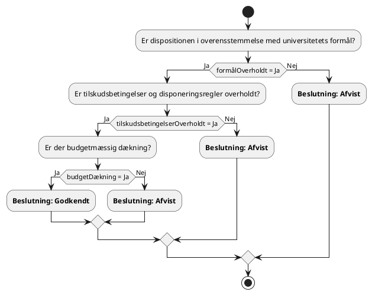

#### **Sporbarhed til Universitetsloven (§ 21)**:

1. **Formål overholdt** (`formålOverholdt`):

   - **Lovgrundlag**: § 21, stk. 1 - Universitetet disponerer frit inden for sit formål.

2. **Tilskudsbetingelser overholdt** (`tilskudsbetingelserOverholdt`):

   - **Lovgrundlag**: § 21, stk. 1 - Det er en betingelse, at universitetet overholder tilskudsbetingelser og disponeringsregler.

3. **Budgetdækning** (`budgetDækning`):

   - **Lovgrundlag**: God økonomisk praksis kræver, at der er budgetmæssig dækning for økonomiske dispositioner.

#### **Bemærkninger**:

- **Godkendelse**: Kun muligt, hvis alle tre kriterier er opfyldt.

- **Afvisning**: Hvis dispositionen ikke er i overensstemmelse med universitetets formål, tilskudsbetingelser ikke er overholdt, eller der mangler budgetdækning.

- **Ansvarlig økonomistyring**: Sikrer, at universitetet anvender sine midler korrekt og i overensstemmelse med loven.

- **Lovmæssig overensstemmelse**: Beslutningsprocessen understøtter korrekt økonomisk forvaltning i henhold til lovgivningen.

### **Beslutning: Merit og forhåndsmerit for uddannelseselementer**

#### **Lovhenvisning**: § 8, stk. 4

#### **Beskrivelse**: Universitetet skal afgøre, om en studerende kan få merit for tidligere gennemførte uddannelseselementer fra andre uddannelser, og om forhåndsmerit kan gives for planlagte studieophold.

#### **DMN-komponenter**:

- **Beslutning**: Tildeling af merit
- **Input**:
  - **Relevans af uddannelseselement** (`relevansAfUddannelseselement`): Om det tidligere uddannelseselement er relevant for den aktuelle uddannelse (Boolean).
  - **Niveau af uddannelseselement** (`niveauAfUddannelseselement`): Om niveauet svarer til det krævede niveau (Boolean).
  - **Karakter opnået** (`karakterOpnået`): Om den studerende har bestået uddannelseselementet med tilstrækkelig karakter (Boolean).
- **Output**:
  - **Beslutning** (`beslutning`): Resultatet af meritudværdelsen ("Merit godkendt", "Merit afvist").

#### **Hit Policy**: **U** (Unique) - Kun én regel kan gælde.

#### **Beslutningstabel**:

| **Regel** | `relevansAfUddannelseselement` | `niveauAfUddannelseselement` | `karakterOpnået` | **Beslutning**   |
|-----------|-------------------------------|------------------------------|------------------|------------------|
| 1         | Ja                            | Ja                           | Ja               | Merit godkendt   |
| 2         | Nej                           | -                            | -                | Merit afvist     |
| 3         | Ja                            | Nej                          | -                | Merit afvist     |
| 4         | Ja                            | Ja                           | Nej              | Merit afvist     |

#### **Bemærkning**: "-" indikerer, at værdien er irrelevant for den pågældende regel.

#### **PlantUML-diagram**:

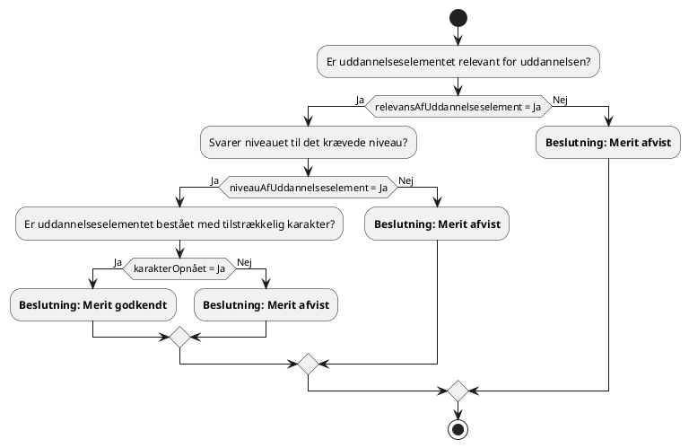

#### ** Sporbarhed til Universitetsloven (§ 8, stk. 4)**:

1. **Relevans af uddannelseselement** (`relevansAfUddannelseselement`):

   - **Lovgrundlag**: § 8, stk. 4 - Ministeren fastsætter regler om, at forhåndsgodkendte uddannelseselementer, der efterfølgende er gennemført og bestået, erstatter dele af uddannelsen (merit).

2. **Niveau af uddannelseselement** (`niveauAfUddannelseselement`):

   - **Lovgrundlag**: Universitetet skal sikre, at det tidligere uddannelseselement er på et niveau, der svarer til den aktuelle uddannelse.

3. **Karakter opnået** (`karakterOpnået`):

   - **Lovgrundlag**: Merit kan normalt kun gives for uddannelseselementer, der er bestået tilfredsstillende.

#### **Bemærkninger**:

- **Meritprocessen**: Sikrer, at studerende ikke skal gennemføre tilsvarende uddannelseselementer igen.
- **Afslag**: Gives, hvis uddannelseselementet ikke er relevant, niveauet ikke svarer, eller hvis det ikke er bestået tilfredsstillende.
- **Ankenævn**: Afgørelser om merit kan indbringes for et ankenævn (§ 18 a).

### **Beslutning: Udstedelse af eksamensbevis med udmærkelse**

#### **Lovhenvisning**: § 8, stk. 2

#### **Beskrivelse**: Universitetet kan udstede eksamensbeviser, der påføres udmærkelser og anerkendelser til talentfulde studerende, der har deltaget i ekstra uddannelsesaktiviteter.

#### **DMN-komponenter**:

- **Beslutning**: Udstedelse af eksamensbevis med udmærkelse
- **Input**:
  - **Ekstra aktivitet gennemført** (`ekstraAktivitetGennemført`): Om den studerende har gennemført ekstra uddannelsesaktiviteter (Boolean).
  - **Højt fagligt niveau** (`højtFagligtNiveau`): Om den studerende har udvist et højt fagligt niveau (Boolean).
- **Output**:
  - **Beslutning** (`beslutning`): Resultatet af vurderingen ("Udmærkelse tildelt", "Ingen udmærkelse").

#### **Hit Policy**: **U** (Unique) - Kun én regel kan gælde.

#### **Beslutningstabel**:

| **Regel** | `ekstraAktivitetGennemført` | `højtFagligtNiveau` | **Beslutning**     |
|-----------|-----------------------------|---------------------|--------------------|
| 1         | Ja                          | Ja                  | Udmærkelse tildelt |
| 2         | Nej                         | -                   | Ingen udmærkelse   |
| 3         | Ja                          | Nej                 | Ingen udmærkelse   |

#### **Bemærkning**: "-" indikerer, at værdien er irrelevant for den pågældende regel.

#### **PlantUML-diagram**:

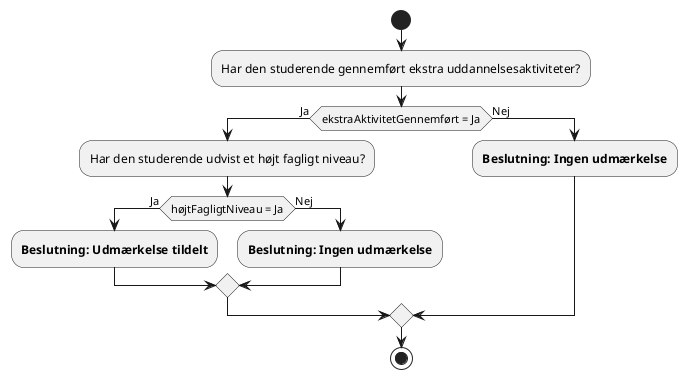

#### **Sporbarhed til Universitetsloven (§ 8, stk. 2)**:

1. **Ekstra aktivitet gennemført** (`ekstraAktivitetGennemført`):

   - **Lovgrundlag**: § 8, stk. 2 - Ministeren fastsætter regler om ekstra uddannelsesaktivitet og om udstedelse af eksamensbeviser, der kan påføres udmærkelse og anerkendelse.

2. **Højt fagligt niveau** (`højtFagligtNiveau`):

   - **Lovgrundlag**: Tildeling af udmærkelse kan være baseret på den studerendes faglige præstationer.

#### **Bemærkninger**:

- **Formål**: At anerkende og motivere talentfulde studerende.
- **Ingen udmærkelse**: Hvis kriterierne ikke er opfyldt, udstedes eksamensbeviset uden udmærkelse.

### **Beslutning: Vejledning til forsinkede studerende**

#### **Lovhenvisning**: § 9, stk. 2

#### **Beskrivelse**: Universitetet har pligt til at tilbyde særlig vejledning til studerende, der er blevet forsinket i forhold til den normerede studietid, for at hjælpe dem med at fortsætte deres uddannelse.

#### **DMN-komponenter**:

- **Beslutning**: Tilbud om særlig vejledning
- **Input**:
  - **Studietidsforsinkelse** (`studietidsForsinkelse`): Om den studerende er forsinket i forhold til normeret studietid (Boolean).
- **Output**:
  - **Beslutning** (`beslutning`): Resultatet af vurderingen ("Tilbyd vejledning", "Ingen handling").

#### **Hit Policy**: **U** (Unique) - Kun én regel kan gælde.

#### **Beslutningstabel**:

| **Regel** | `studietidsForsinkelse` | **Beslutning**   |
|-----------|-------------------------|------------------|
| 1         | Ja                      | Tilbyd vejledning|
| 2         | Nej                     | Ingen handling   |

#### **PlantUML-diagram**:

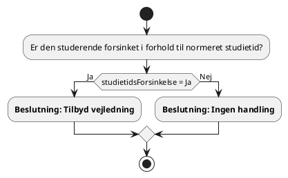

#### **Sporbarhed til Universitetsloven (§ 9, stk. 2)**:

1. **Studietidsforsinkelse** (`studietidsForsinkelse`):

   - **Lovgrundlag**: § 9, stk. 2 - Universitetet har pligt til at give studerende, der er blevet forsinket, særlig vejledning.

#### **Bemærkninger**:

- **Formål**: At støtte studerende i at gennemføre deres uddannelse på trods af forsinkelser.
- **Ingen handling**: Hvis den studerende ikke er forsinket, er der ingen yderligere handling nødvendig.

### **Beslutning: Udstedelse af advarsel ved manglende studieaktivitet**

#### **Lovhenvisning**: § 8, stk. 3

#### **Beskrivelse**: Universitetet skal fastsætte interne regler om studieaktivitetskrav og kan udstede advarsler til studerende, der ikke opfylder disse krav.

#### **DMN-komponenter**:

- **Beslutning**: Udstedelse af advarsel
- **Input**:
  - **Studieaktivitetskrav opfyldt** (`studieaktivitetskravOpfyldt`): Om den studerende opfylder studieaktivitetskravene (Boolean).
- **Output**:
  - **Beslutning** (`beslutning`): Resultatet af vurderingen ("Ingen advarsel", "Udsted advarsel").

#### **Hit Policy**: **U** (Unique) - Kun én regel kan gælde.

#### **Beslutningstabel**:

| **Regel** | `studieaktivitetskravOpfyldt` | **Beslutning**     |
|-----------|-------------------------------|--------------------|
| 1         | Ja                            | Ingen advarsel     |
| 2         | Nej                           | Udsted advarsel    |

#### **PlantUML-diagram**:

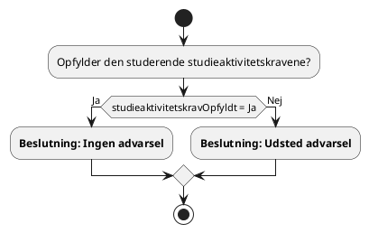

#### **Sporbarhed til Universitetsloven (§ 8, stk. 3)**:

1. **Studieaktivitetskrav opfyldt** (`studieaktivitetskravOpfyldt`):

   - **Lovgrundlag**: § 8, stk. 3 - Ministeren fastsætter regler om universitetets pligt til at fastsætte interne regler om studieaktivitetskrav.

#### **Bemærkninger**:

- **Formål**: At sikre, at studerende er studieaktive og gør fremskridt i deres uddannelse.
- **Konsekvenser**: Gentagen manglende opfyldelse af studieaktivitetskrav kan føre til udskrivning fra studiet.

## **Implementering i Applikationslandskabet**

For at integrere disse DMN-modeller i vores systemer skal vi:

- **Udvikle eller tilpasse eksisterende IT-systemer** til at understøtte beslutningsmodellerne.
- **Træne personale** i anvendelse og vedligeholdelse af DMN-modellerne.
- **Etablere governance-processer** for at sikre løbende opdatering i overensstemmelse med lovændringer.
- **Sikre integration** mellem DMN-modellerne og vores forretningsprocesser samt applikationer.

## **Konklusion**

Ved at dokumentere Universitetsloven i DMN opnår vi en klar og struktureret forståelse af de forretningsregler, der styrer vores aktiviteter. Dette vil forbedre vores evne til at overholde lovgivningen, optimere processer og understøtte vores strategiske mål.